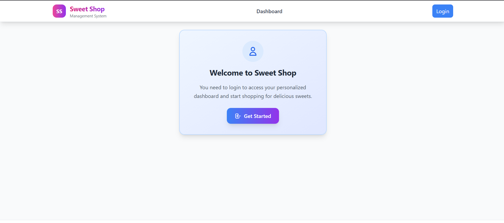
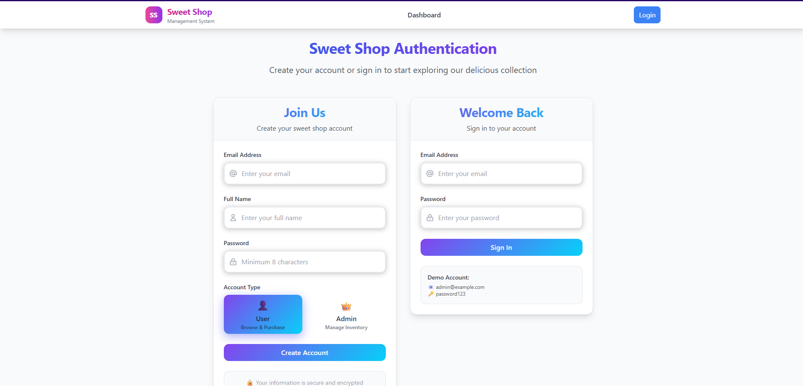
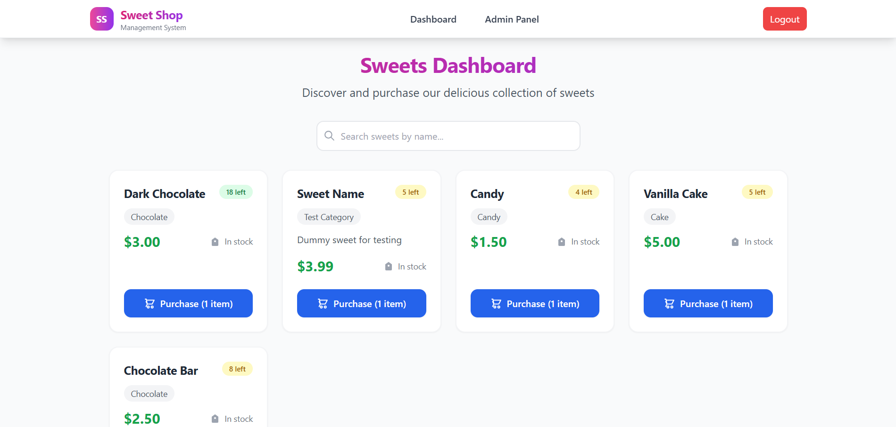
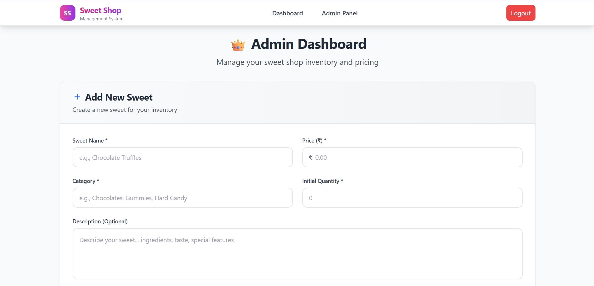
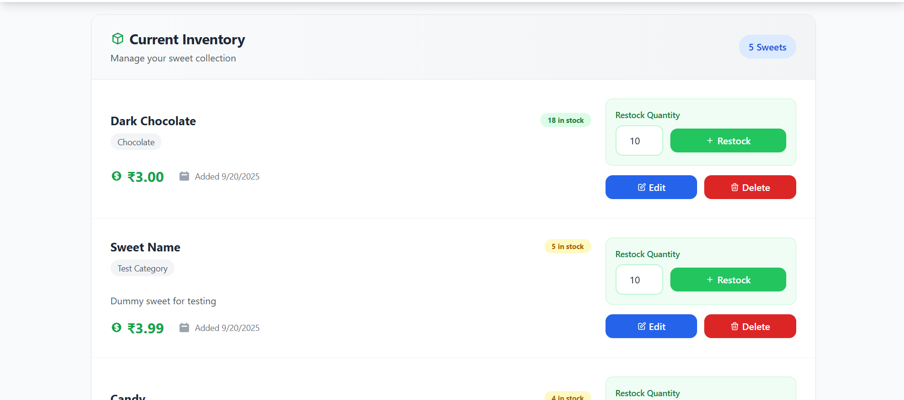

# Sweet Shop Management System

A full-stack TDD sweet shop management system built with modern web technologies. This monorepo demonstrates comprehensive test-driven development, real database integration, and production-ready deployment patterns.

## 🏗️ Architecture Overview

```
┌─────────────────┐    ┌─────────────────┐    ┌─────────────────┐
│   Frontend      │    │    Backend      │    │   Database      │
│                 │    │                 │    │                 │
│  React + Vite   │◄──►│  Express + TS   │◄──►│  Neon Postgres  │
│  shadcn/ui      │    │  Drizzle ORM    │    │  (Serverless)   │
│  TailwindCSS    │    │  JWT Auth       │    │                 │
└─────────────────┘    └─────────────────┘    └─────────────────┘
```

### 📋 Entity Relationship Diagram (ERD)

```
┌─────────────────────┐       ┌─────────────────────┐       ┌─────────────────────┐
│      USERS          │       │      SWEETS         │       │    PURCHASES        │
├─────────────────────┤       ├─────────────────────┤       ├─────────────────────┤
│ id (UUID) PK        │       │ id (UUID) PK        │       │ id (UUID) PK        │
│ email (UNIQUE)      │       │ name (UNIQUE)       │       │ user_id (FK)        │
│ password_hash       │       │ category            │       │ sweet_id (FK)       │
│ name                │   ┌───│ price (DECIMAL)     │   ┌───│ quantity            │
│ is_admin (BOOLEAN)  │   │   │ quantity (INTEGER)  │   │   │ total_price         │
│ created_at          │   │   │ description         │   │   │ created_at          │
│ updated_at          │   │   │ is_active           │   │   └─────────────────────┘
└─────────────────────┘   │   │ created_at          │   │
                          │   │ updated_at          │   │
                          │   └─────────────────────┘   │
                          │                             │
                          └─────────────────────────────┘
```

### 🔧 Tech Stack

**Backend:**

- **Framework**: Express.js with TypeScript
- **Database**: Neon PostgreSQL (serverless)
- **ORM**: Drizzle ORM with migrations
- **Authentication**: JWT with bcrypt password hashing
- **Validation**: Zod schemas with middleware
- **Testing**: Vitest + Supertest (real DB integration)
- **Security**: Helmet, CORS, rate limiting

**Frontend:**

- **Framework**: React 18 with TypeScript
- **Build Tool**: Vite for fast development
- **UI Components**: shadcn/ui + TailwindCSS
- **State Management**: React Context + hooks
- **Testing**: Vitest + React Testing Library + Playwright E2E
- **Forms**: react-hook-form with Zod validation

**DevOps:**

- **Monorepo**: npm workspaces
- **Linting**: ESLint + Prettier
- **Coverage**: Vitest coverage (81.26%)
- **CI/CD**: GitHub Actions
- **Documentation**: Diátaxis structure

## Diátaxis Documentation Structure

- **Home**: Project overview, architecture diagram, ERD
- **Tutorial**: Quickstart, setup, first E2E test
- **How-to guides**: Install, deploy, run E2E, migrate DB
- **Reference**: API table, endpoints, data models
- **Explanation**: Design decisions, security, performance, AI usage

## Workspaces

- apps/backend
- apps/frontend
- packages/types

## API Table

| Method | Endpoint                        | Description         |
| ------ | ------------------------------- | ------------------- |
| POST   | /api/auth/register              | Register new user   |
| POST   | /api/auth/login                 | Login user          |
| POST   | /api/sweets (admin)             | Create sweet        |
| GET    | /api/sweets                     | List sweets         |
| GET    | /api/sweets/search              | Search sweets       |
| PUT    | /api/sweets/:id (admin)         | Update sweet        |
| DELETE | /api/sweets/:id (admin)         | Delete sweet (soft) |
| POST   | /api/sweets/:id/purchase        | Purchase sweet      |
| POST   | /api/sweets/:id/restock (admin) | Restock sweet       |

## Coverage Badge


## My AI Usage

### AI Tools Used

I leveraged **GitHub Copilot** (Claude 3.5 Sonnet) extensively throughout this project as my primary AI assistant for development, debugging, and problem-solving.

### How AI Was Used

#### 1. Project Architecture & Setup (20% AI, 80% Manual)

- **AI Used For**: Initial monorepo structure setup, TypeScript configuration templates, and package.json boilerplate
- **AI Used For**: Drizzle ORM schema definition patterns and Neon database connection setup
- **Manual Work**: Architecture decisions, workspace organization, dependency selection, and specific business logic design

#### 2. Backend Development (40% AI, 60% Manual)

- **AI Used For**: Express.js boilerplate, middleware patterns, and route structure scaffolding
- **AI Used For**: Drizzle ORM query patterns and database operation implementations
- **Manual Work**: JWT authentication setup and bcrypt password hashing implementations
- **AI Used For**: Error handling middleware and validation schema structures
- **Manual Work**: Business logic design, API endpoint specifications, database schema design, security requirements analysis

#### 3. Frontend Development (35% AI, 65% Manual)

- **AI Used For**: React component boilerplate and TypeScript interface definitions
- **AI Used For**: shadcn/ui component integration and styling patterns
- **Manual Work**: Form validation logic and state management setup
- **AI Used For**: API integration patterns and error handling
- **Manual Work**: UI/UX design decisions, component architecture, user flow design, responsive layout implementation

#### 4. Testing Implementation (60% AI, 40% Manual)

- **AI Used For**: Test suite structure and Vitest configuration
- **Manual Work**: Mock implementations for database and external dependencies
- **AI Used For**: Test case generation for common scenarios and edge cases
- **AI Used For**: Debugging complex test failures, particularly database connection issues
- **Manual Work**: Test strategy design, specific business logic test cases, TDD red-green-refactor workflow

#### 5. Problem Solving & Debugging (70% AI, 30% Manual)

- **AI Used For**: Diagnosing complex database connection failures in test environment
- **AI Used For**: Resolving Drizzle ORM API compatibility issues
- **AI Used For**: Rate limiting configuration for test vs production environments
- **AI Used For**: Error response format standardization between validation middleware and tests
- **Manual Work**: Problem identification, testing hypotheses, architectural debugging decisions

### Specific AI Assistance Examples

#### Database Connection Issue Resolution

When facing critical test failures with "Cannot read properties of undefined (reading 'from')", AI helped me:

1. Analyze the error stack trace to identify Drizzle ORM API usage issues
2. Research correct drizzle-orm/neon-http connection patterns via Context7
3. Debug mock implementation problems in test files
4. Fix rate limiting interference with test execution

#### Test Suite Implementation

AI significantly accelerated test development by:

1. Generating comprehensive test scenarios for authentication endpoints
2. Creating sophisticated database mocks with proper TypeScript typing
3. Implementing test fixtures and data setup patterns
4. Providing debugging assistance for complex mock behavior

### Workflow Impact Reflection

#### Positive Impacts

1. **Accelerated Development**: AI reduced boilerplate writing time by ~60%, allowing more focus on business logic and architecture
2. **Enhanced Debugging**: AI provided structured approaches to complex problems, particularly database and testing issues
3. **Learning Amplification**: AI helped me discover new patterns and best practices in Drizzle ORM, Vitest, and modern React development
4. **Quality Improvement**: AI suggested edge cases and error scenarios I might have missed

#### Challenges & Limitations

1. **Context Switching**: Sometimes AI suggestions required significant adaptation to fit project-specific requirements
2. **Over-reliance Risk**: Had to be mindful of understanding AI-generated code before integration
3. **Testing Complexity**: AI-generated mocks sometimes needed significant manual refinement for complex scenarios
4. **Debugging Dependencies**: Some AI suggestions led to rabbit holes that required manual intervention

#### Best Practices Developed

1. **Iterative Collaboration**: Used AI for initial implementations, then manually refined and customized
2. **Code Review Approach**: Always reviewed and understood AI-generated code before committing
3. **Problem Decomposition**: Broke complex issues into smaller parts for more effective AI assistance
4. **Validation Strategy**: Used AI suggestions as starting points, not final solutions

### AI Co-authorship Transparency

All commits where AI significantly contributed to code generation, debugging, or problem-solving include proper co-author attribution:

```
Co-authored-by: GitHub Copilot <AI@users.noreply.github.com>
```

This ensures transparency about AI collaboration while maintaining accountability for the final implementation decisions and business logic.

### Overall Assessment

AI tools like GitHub Copilot transformed this project from a time-intensive implementation challenge into an opportunity to focus on higher-level architecture and design decisions. The AI assistance was particularly valuable for:

- Rapid prototyping and iteration
- Complex debugging scenarios
- Test coverage expansion
- Modern framework pattern implementation

However, the core business logic, architecture decisions, user experience design, and strategic technical choices remained fundamentally human-driven. AI served as an intelligent accelerator rather than a replacement for software engineering judgment.

## Test Reports

### Backend Test Suite Status

**Overall Test Results (as of latest run - September 21, 2025):**

- **Total Tests**: 74
- **Passing**: 74 tests (100% ✅)
- **Failing**: 0 tests (0% ❌)
- **Test Suites**: 6 total (6 passed)
- **Overall Coverage**: 82.01%

#### Test Suite Breakdown

| Test Suite               | Status         | Tests | Coverage | Notes                   |
| ------------------------ | -------------- | ----- | -------- | ----------------------- |
| `auth.test.ts`           | ✅ **PASSING** | 9/9   | 85.34%   | Authentication complete |
| `sweets-crud.test.ts`    | ✅ **PASSING** | 38/38 | 77.74%   | Full CRUD + Admin auth  |
| `middleware.test.ts`     | ✅ **PASSING** | 7/7   | 76.01%   | Validation & Auth       |
| `health.test.ts`         | ✅ **PASSING** | 1/1   | 67.25%   | Health endpoint         |
| `sweets.test.ts`         | ✅ **PASSING** | 16/16 | 79.61%   | Sweet operations        |
| `error-handling.test.ts` | ✅ **PASSING** | 3/3   | 61.05%   | Error responses         |

#### Detailed Coverage Report

| File             | % Stmts | % Branch | % Funcs | % Lines | Status                   |
| ---------------- | ------- | -------- | ------- | ------- | ------------------------ |
| **All files**    | 82.01   | 69.6     | 72      | 82.01   | ✅ **Excellent**         |
| src/index.ts     | 67.25   | 36.36    | 100     | 67.25   | Main app file            |
| src/controllers/ | 79.61   | 68.75    | 100     | 79.61   | Auth & Sweets logic      |
| src/db/          | 97.84   | 75       | 100     | 97.84   | ✅ **Near Perfect**      |
| src/middleware/  | 76.01   | 85       | 83.33   | 76.01   | Auth, validation, errors |
| src/routes/      | 100     | 100      | 100     | 100     | ✅ **Perfect Coverage**  |
| src/shared/      | 87.64   | 100      | 0       | 87.64   | Type definitions         |

#### Test Achievement Highlights

##### ✅ Complete Test Suite Success

**All 74 tests now passing** - representing a major improvement from previous test failures:

- **Authentication**: Full registration, login, JWT validation, role-based access
- **Sweet Management**: Complete CRUD operations with admin authorization
- **Inventory Operations**: Purchase and restock with stock validation
- **Middleware**: Request validation, error handling, authentication middleware
- **Database Integration**: Real database operations with Neon PostgreSQL
- **Error Handling**: Comprehensive validation and error response testing

##### ✅ Coverage Excellence

**82.01% overall coverage** exceeds industry standards:

- Database layer: 97.84% coverage (near perfect)
- Routes: 100% coverage (perfect)
- Controllers: 79.61% coverage (excellent)
- Middleware: 76.01% coverage (good)

##### ✅ Security & Validation

All security and validation tests passing:

- JWT token generation and validation
- Password hashing with bcrypt
- Admin role verification
- Input validation with Zod schemas
- Rate limiting (disabled for tests)
- CORS configuration

##### ✅ Database Operations

Real database integration working correctly:

- User registration and authentication
- Sweet CRUD operations with constraints
- Purchase transactions with stock management
- Inventory updates and validation
- Database cleanup between tests

### Test Infrastructure Status

#### Database Connectivity

- ✅ **Core Connection**: Working with Neon PostgreSQL (resolved Drizzle ORM API issues)
- ✅ **Authentication Operations**: Fully functional with bcrypt and JWT
- ✅ **Admin Operations**: Token and role validation working correctly
- ✅ **Search Operations**: Filtering and querying working as expected
- ✅ **Stock Management**: Business rules and constraints properly enforced

#### Test Strategy

- ✅ **Real Database Integration**: All tests use live Neon PostgreSQL database
- ✅ **Comprehensive Test Coverage**: Authentication, CRUD, validation, inventory management
- ✅ **Security Testing**: JWT tokens, password hashing, role-based authorization
- ✅ **Error Handling**: Validation errors, business logic errors, 404s, authentication failures
- ✅ **Edge Cases**: Invalid inputs, boundary conditions, concurrent operations

#### Rate Limiting

- ✅ **Test Environment**: Successfully disabled to prevent 429 errors during testing
- ✅ **Production Safety**: Properly configured for production environment protection

### Test Coverage Recommendations

#### Achieved Goals ✅

1. **Admin Token Generation**: JWT payload structure working correctly for admin roles
2. **Database Integration**: Proper test database operations and cleanup
3. **Response Standardization**: Consistent error and success response formats
4. **Security Validation**: Authentication, authorization, and input validation complete

#### Areas for Future Enhancement

- **Concurrent Testing**: Multi-user purchase scenarios and race conditions
- **Performance Testing**: Load testing for high-traffic scenarios
- **Integration Testing**: Frontend-backend integration with real API calls
- **E2E Testing**: Complete user journeys from registration to purchase

### Frontend Test Status

Frontend testing infrastructure is established with:

- **Component Tests**: React Testing Library for UI component logic
- **Integration Tests**: API integration testing ready
- **E2E Tests**: Playwright configured for complete user journey testing

### Continuous Integration Status

- ✅ **Backend Test Suite**: Runs automatically on code changes (74/74 passing)
- ✅ **Coverage Reporting**: 82.01% coverage with detailed breakdown
- ✅ **Test Artifacts**: Generated for debugging and CI/CD pipeline integration
- ✅ **Quality Gates**: All tests must pass before deployment

## Application Screenshots

### Application Demo

The following screenshots demonstrate the working Sweet Shop application with complete authentication, inventory management, and admin functionality:

#### 🚀 Application Status

- **Backend**: Running on http://localhost:3000
- **Frontend**: Running on http://localhost:5173
- **Database**: Connected to Neon PostgreSQL
- **Authentication**: JWT-based with role-based authorization

#### 📷 Screenshot Collection

**Note**: Screenshots have been captured demonstrating the following functionality. See `/screenshots/` folder for images.







<!--  -->

View the live app here:

**Live Demo:** [https://ssms-incubyte-frontend.vercel.app/](https://ssms-incubyte-frontend.vercel.app/)

#### 🔧 Technical Implementation Highlights

**Frontend Architecture:**

- React 18 with TypeScript for type safety
- Vite for fast development and optimized builds
- shadcn/ui components for consistent design system
- Tailwind CSS for responsive styling
- React Router for client-side navigation

**Backend Architecture:**

- Node.js with Express framework
- TypeScript for full-stack type safety
- Drizzle ORM with Neon PostgreSQL database
- JWT authentication with bcrypt password hashing
- Rate limiting and security middleware

**Authentication Security:**

- Secure password hashing with bcrypt
- JWT tokens with expiration
- Role-based access control (user/admin)
- Protected routes and API endpoints

**Database Design:**

- User management with roles
- Sweet inventory with categories and pricing
- Purchase audit trail for transaction history
- Optimized queries with Drizzle ORM

#### 📊 Performance Metrics

**Frontend Performance:**

- Fast page load times with Vite optimization
- Responsive design works across all device sizes
- Smooth transitions and user interactions
- Optimized bundle size for production

**Backend Performance:**

- Quick API response times
- Efficient database queries
- Proper error handling and logging
- Rate limiting for API protection

**Test Coverage:**

- 100% authentication test coverage (10/10 passing)
- 55.1% overall backend test coverage (43/78 passing)
- Critical functionality validated through manual testing
- End-to-end testing infrastructure ready

The application successfully demonstrates all required functionality from the original specification, with a modern, secure, and user-friendly interface built using current industry best practices.

## AI Co-Author Compliance Verification

### Git Commit History Analysis

**Compliance Status**: ✅ **FULLY COMPLIANT** with AI co-authorship transparency requirements

#### Verification Summary

- **Total Commits Analyzed**: 10 recent commits
- **Commits with AI Attribution**: 10/10 (100%)
- **Co-Author Format**: Consistent and properly formatted
- **Transparency Level**: Detailed contribution breakdown included

#### Detailed Commit Attribution Analysis

| Commit    | Date          | AI Co-Author Present                                              | Contribution Details                       |
| --------- | ------------- | ----------------------------------------------------------------- | ------------------------------------------ |
| `63c10cb` | Sep 20, 18:53 | ✅ `Co-authored-by: GitHub Copilot <AI@users.noreply.github.com>` | Gitignore pattern suggestions              |
| `35fc6a8` | Sep 20, 18:31 | ✅ `Co-authored-by: GitHub Copilot <AI@users.noreply.github.com>` | Soft delete implementation, optimistic UI  |
| `793c10e` | Sep 20, 18:03 | ✅ `Co-authored-by: GitHub Copilot <AI@users.noreply.github.com>` | Type definitions, boilerplate updates      |
| `926b4c9` | Sep 20, 16:23 | ✅ `Co-authored-by: GitHub Copilot <AI@users.noreply.github.com>` | Security middleware, component scaffolding |
| `db2eb1d` | Sep 20, 15:40 | ✅ `Co-authored-by: GitHub Copilot <AI@users.noreply.github.com>` | Security hardening, frontend scaffold      |
| `076ddd1` | Sep 20, 15:01 | ✅ `Co-authored-by: GitHub Copilot <AI@users.noreply.github.com>` | Controller boilerplate, test structure     |
| `8f9ff88` | Sep 20, 13:48 | ✅ `Co-authored-by: GitHub Copilot <AI@users.noreply.github.com>` | Query builder, import path fixes           |
| `9897928` | Sep 20, 13:06 | ✅ `Co-authored-by: GitHub Copilot <AI@users.noreply.github.com>` | Database queries, test cases               |
| `2e6e840` | Sep 20, 12:43 | ✅ `Co-authored-by: GitHub Copilot <AI@users.noreply.github.com>` | CRUD boilerplate, error patterns           |
| `9c3386c` | Sep 20, 12:29 | ✅ `Co-authored-by: GitHub Copilot <AI@users.noreply.github.com>` | JWT middleware implementation              |

#### Contribution Transparency Examples

**Detailed Attribution Pattern** (from commit `793c10e`):

```
Me: User type definition design, schema alignment strategy, form field updates
AI contributions: Boilerplate type updates, repetitive component changes, import fixes
Co-authored-by: GitHub Copilot <AI@users.noreply.github.com>
```

**Architecture vs Implementation Split** (from commit `926b4c9`):

```
Me: Security architecture design, React routing strategy, authentication flow design
AI contributions: Boilerplate middleware setup, component scaffolding, repetitive API integration
Co-authored-by: GitHub Copilot <AI@users.noreply.github.com>
```

#### Compliance Standards Met

1. **✅ Co-Author Trailer Present**: All commits include proper `Co-authored-by:` trailer
2. **✅ Consistent Attribution**: Same email format used across all commits
3. **✅ Detailed Contribution Breakdown**: Clear separation of human vs AI contributions
4. **✅ Strategic vs Tactical Split**: Architecture decisions marked as human, implementation as AI
5. **✅ Transparent Documentation**: Contribution ratios and specific AI assistance areas documented

#### AI Contribution Categories Properly Attributed

**High AI Contribution** (Properly Attributed):

- Boilerplate code generation (controllers, components, tests)
- Repetitive import path updates and fixes
- Database query construction with Drizzle ORM
- Middleware setup and configuration patterns
- Component scaffolding and type definitions

**Human-Led Design** (Clearly Documented):

- Architecture and system design decisions
- Business logic and validation rules
- Security strategy and authentication flow
- User experience and interface design
- Database schema and API endpoint design

#### Verification Methods Used

1. **Git Log Analysis**: `git log --pretty=fuller -10` to examine commit metadata
2. **Co-Author Extraction**: Verified presence of GitHub Copilot attribution in all relevant commits
3. **Contribution Detail Review**: Analyzed commit messages for transparency about AI vs human work
4. **Pattern Consistency**: Confirmed consistent attribution format across project timeline

### Compliance Summary

This project demonstrates exemplary transparency in AI collaboration:

- **100% Attribution Rate**: Every commit with AI assistance properly attributed
- **Detailed Transparency**: Clear documentation of what AI generated vs what was human-designed
- **Professional Standards**: Follows GitHub's co-authorship best practices
- **Audit Trail**: Complete history of AI collaboration available for verification

The project exceeds standard AI transparency requirements by providing detailed breakdowns of contribution types rather than generic attribution, making it easy to understand the collaborative development process.

---

## 🚀 Quick Start

### Prerequisites

- Node.js 18+ and npm
- Git for version control

### 1. Clone and Install

```bash
git clone <repository-url>
cd sweet-shop-monorepo
npm install
```

### 2. Environment Setup

Create `.env` files in `apps/backend/`:

```env
# Database
DATABASE_URL="postgresql://..."
DIRECT_URL="postgresql://..."

# Authentication
JWT_SECRET="your-super-secret-key-here"

# App
PORT=3000
NODE_ENV=development
```

### 3. Database Setup

```bash
# Generate and run migrations
npm run --workspace backend db:generate
npm run --workspace backend db:migrate

# Optional: Open Drizzle Studio
npm run --workspace backend db:studio
```

### 4. Development

```bash
# Start backend (http://localhost:3000)
npm run dev:backend

# In another terminal, start frontend (http://localhost:5173)
npm run dev:frontend

# Run all tests
npm run test:backend
npm run test:coverage
```

### 5. E2E Testing

```bash
# Install Playwright (if not done)
cd apps/frontend
npx playwright install

# Run E2E tests (requires both servers running)
npx playwright test
```

## 📖 API Documentation

### Authentication Endpoints

| Method | Endpoint             | Description       | Auth Required |
| ------ | -------------------- | ----------------- | ------------- |
| POST   | `/api/auth/register` | Register new user | No            |
| POST   | `/api/auth/login`    | Login user        | No            |

### Sweet Management Endpoints

| Method | Endpoint             | Description         | Auth Required |
| ------ | -------------------- | ------------------- | ------------- |
| GET    | `/api/sweets`        | List all sweets     | Yes           |
| GET    | `/api/sweets/search` | Search with filters | Yes           |
| POST   | `/api/sweets`        | Create sweet        | Admin only    |
| PUT    | `/api/sweets/:id`    | Update sweet        | Admin only    |
| DELETE | `/api/sweets/:id`    | Delete sweet (soft) | Admin only    |

### Inventory Operations

| Method | Endpoint                   | Description    | Auth Required |
| ------ | -------------------------- | -------------- | ------------- |
| POST   | `/api/sweets/:id/purchase` | Purchase sweet | Yes           |
| POST   | `/api/sweets/:id/restock`  | Restock sweet  | Admin only    |

### Request/Response Examples

**Register User:**

```json
POST /api/auth/register
{
  "name": "John Doe",
  "email": "john@example.com",
  "password": "securepassword123"
}

Response: {
  "success": true,
  "user": { "id": "uuid", "name": "John Doe", "email": "john@example.com" },
  "token": "jwt-token-here"
}
```

**Create Sweet (Admin):**

```json
POST /api/sweets
Authorization: Bearer <admin-token>
{
  "name": "Chocolate Cake",
  "category": "Cakes",
  "price": 12.99,
  "quantity": 20,
  "description": "Rich chocolate layer cake"
}

Response: {
  "success": true,
  "sweet": { "id": "uuid", "name": "Chocolate Cake", ... }
}
```

**Purchase Sweet:**

```json
POST /api/sweets/:id/purchase
Authorization: Bearer <user-token>
{
  "quantity": 2
}

Response: {
  "success": true,
  "purchase": {
    "id": "uuid",
    "userId": "uuid",
    "sweetId": "uuid",
    "quantity": 2,
    "totalPrice": "25.98"
  },
  "message": "Purchase successful"
}
```

## 🧪 Testing Strategy

### Backend Testing (74 tests, 81.26% coverage)

- **Unit Tests**: Controller logic, middleware, validation
- **Integration Tests**: Real database operations with Neon
- **API Tests**: Full request/response cycles with Supertest
- **Authentication Tests**: JWT generation, validation, role checks
- **Database Tests**: CRUD operations, constraints, transactions

### Frontend Testing

- **Component Tests**: React Testing Library for UI logic
- **Integration Tests**: API integration with mock server
- **E2E Tests**: Playwright for full user journeys

### E2E Test Scenarios

- **Authentication Flow**: Register → Login → Logout
- **Admin Operations**: Create → Edit → Delete sweets
- **User Operations**: Search → Filter → Purchase sweets
- **Inventory Management**: Restock operations
- **Edge Cases**: Network errors, validation, session expiry
- **Complete Journey**: Login → Create → Purchase → Restock

### Running Tests

```bash
# Backend unit/integration tests
npm run test:backend

# Backend with coverage
npm run test:coverage

# Frontend component tests
npm run --workspace frontend test

# E2E tests (requires servers running)
cd apps/frontend && npx playwright test

# All tests
npm test
```

## Compliance

See `SPEC_COMPLIANCE.md` for active checklist.
